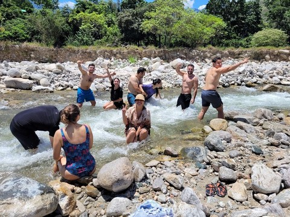
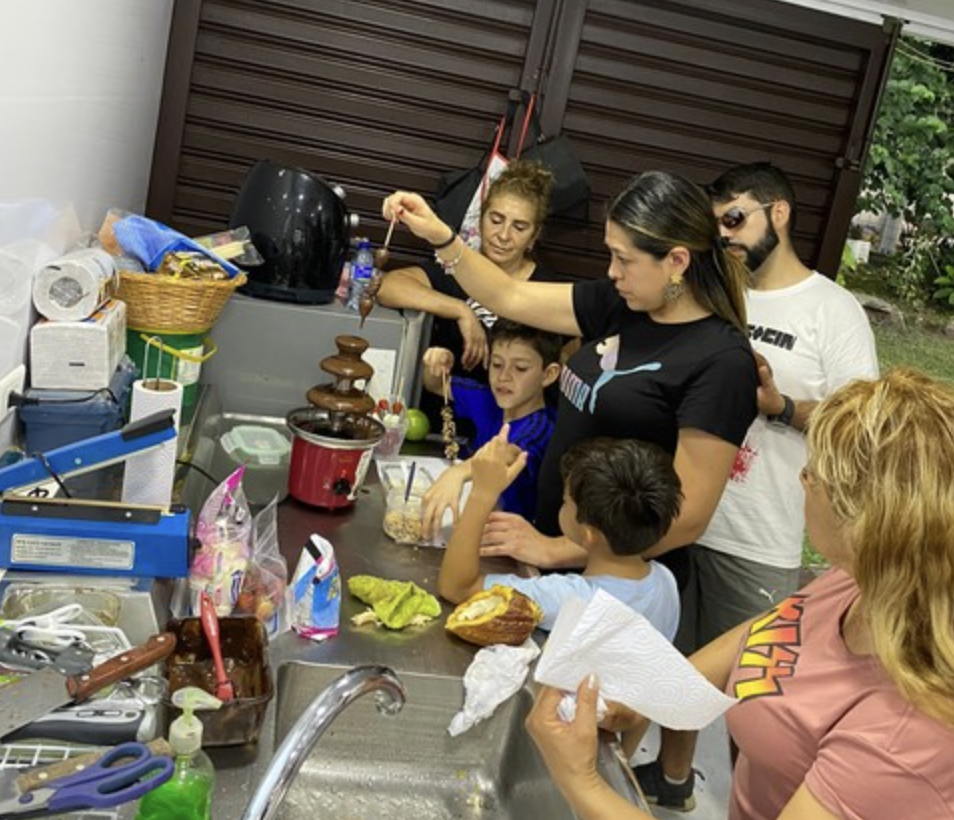
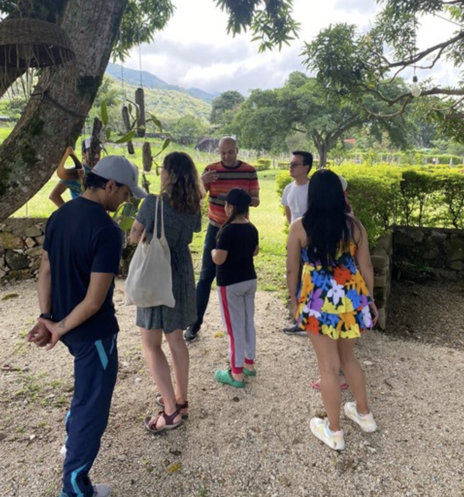

# Plan: Restructure tour.html into tour/ folder

## 🎯 Current Status

**Last Updated**: Phase 3 Complete

### Completed Phases:
- ✅ **Phase 1: Preparation** - Folder created, plan documented
- ✅ **Phase 2: File Updates** - All paths updated, redirect file created
- ✅ **Phase 3: Reference Updates** - All internal references updated

### Next Steps:
- 📝 **Phase 4: Testing** (Required)

---

## Objective
Move `tour.html` into a `tour/` folder structure while maintaining the `termopilas.co/tour` URL and ensuring all functionality remains intact. Implement a redirect file to maintain backward compatibility for all existing `tour.html` links.

## Key Approach
Instead of breaking existing links, we'll:
1. Move content to `tour/index.html` (accessible via `termopilas.co/tour`)
2. Replace root `tour.html` with a lightweight redirect file
3. **Result**: Both `termopilas.co/tour.html` and `termopilas.co/tour` work seamlessly
4. No immediate need to update existing links (redirect handles them)
5. Gradual migration of internal links recommended for best practices

## Current State
- File: `/tour.html` (615 lines)
- URL: `termopilas.co/tour.html` or `termopilas.co/tour`
- References: Multiple internal links from other pages

## Proposed Structure
```
/
├── tour.html        # Redirect file (lightweight, points to tour/)
└── tour/
    ├── index.html   # Current tour.html content (with updated paths)
    └── plan.md      # This file
```

## Changes Required

### 1. File Movement
- **Action**: Rename `tour.html` → `tour/index.html`
- **Result**: URL `termopilas.co/tour` will continue to work (GitHub Pages serves index.html automatically)

### 2. Path Updates in tour/index.html

All relative paths need to go up one directory level (`../`):

#### CSS Files (6 updates)
```html
<!-- FROM -->
<link rel="stylesheet" href="assets/css/fonts.css">
<link rel="stylesheet" href="styles/main.css">
<link rel="stylesheet" href="styles/hero.css">
<link rel="stylesheet" href="styles/utilities.css">
<link rel="stylesheet" href="styles/tour.css">
<link rel="stylesheet" href="styles/whatsapp-button.css">

<!-- TO -->
<link rel="stylesheet" href="../assets/css/fonts.css">
<link rel="stylesheet" href="../styles/main.css">
<link rel="stylesheet" href="../styles/hero.css">
<link rel="stylesheet" href="../styles/utilities.css">
<link rel="stylesheet" href="../styles/tour.css">
<link rel="stylesheet" href="../styles/whatsapp-button.css">
```

#### JavaScript Files (1 update)
```html
<!-- FROM -->
<script src="dist/main.js" defer></script>

<!-- TO -->
<script src="../dist/main.js" defer></script>
```

#### Image Files (15 updates)
```html
<!-- FROM -->
<link rel="icon" href="assets/images/favicon.png">
<meta property="og:image" content="https://termopilas.co/assets/images/tour/tour-hero-bg.jpg">


<!-- TO -->
<link rel="icon" href="../assets/images/favicon.png">
<meta property="og:image" content="https://termopilas.co/assets/images/tour/tour-hero-bg.jpg"> <!-- Keep absolute URLs -->







```

#### Internal Links (1 update in blog post reference)
```html
<!-- FROM -->
<a href="blog/posts/nibs-cacao-parfait-bowl.html">

<!-- TO -->
<a href="../blog/posts/nibs-cacao-parfait-bowl.html">
```

### 3. Files That Reference tour.html

**Important Note**: With the redirect file in place, updating these references is **optional but recommended** for best practices. The redirect ensures all existing links continue to work.

#### Recommended Updates (optional with redirect)

Search for `tour.html` references in these files:

#### HTML Files
- `index.html` - Navigation links
- `alojamiento.html` - May have cross-references
- `coliving.html` - May have cross-references
- `blog.html` - May have cross-references
- `catalogo.html` - May have cross-references
- `cata-vinos.html` - May have cross-references
- `eventos.html` - May have cross-references
- Blog posts in `blog/posts/*.html` - May reference tour

**Update pattern (recommended)**:
```html
<!-- FROM -->
<a href="tour.html">
<a href="/tour.html">

<!-- TO -->
<a href="tour/">
<a href="/tour/">
```

**Note**: Can be done gradually over time since redirect handles backward compatibility.

#### TypeScript/JavaScript Files
Check for hardcoded references:
- `src/ts/components/header.ts` - Navigation configuration
- `src/ts/main.ts` - Routing logic
- Other JS/TS files that might reference the tour page

These should be updated to maintain clean code, but redirect ensures functionality.

### 4. Configuration Files

#### sitemap.xml
- **File**: `/sitemap.xml`
- **Update**: Change `tour.html` to `tour/` or `tour/index.html`

#### scripts/generate-sitemap.js
- **Action**: Review to ensure it picks up `tour/index.html` correctly
- **Note**: May need logic adjustment to handle both patterns

### 5. Redirect File (tour.html)

Instead of deleting the original `tour.html`, replace it with a redirect file for backward compatibility.

#### Option A: Simple Redirect (Recommended for MVP)

Lightweight, fast redirect without analytics overhead:

```html
<!DOCTYPE html>
<html lang="es">
<head>
    <meta charset="UTF-8">
    <meta http-equiv="refresh" content="0; url=tour/">
    <link rel="canonical" href="https://termopilas.co/tour/">
    <title>Redirigiendo...</title>
    <script>
        // Immediate redirect via JavaScript (faster than meta refresh)
        window.location.replace("tour/");
    </script>
</head>
<body>
    <p>Redirigiendo a <a href="tour/">Tour de Vino y Cacao</a>...</p>
</body>
</html>
```

**File size**: ~350 bytes  
**Redirect time**: Instant (JavaScript) or 0ms (meta refresh)

#### Option B: Redirect with Analytics Tracking (Optional)

See detailed version in section 6 below. Use this if you want to monitor redirect usage.

**When to use each**:
- **Option A**: Default choice, cleaner, faster
- **Option B**: If you want to know how many users still use `.html` URLs

**Benefits of redirect approach**:
- ✅ Maintains backward compatibility for all existing `tour.html` links
- ✅ Preserves SEO (301-like redirect via meta refresh + canonical)
- ✅ Works even if JavaScript is disabled (meta refresh fallback)
- ✅ Visible link for extreme edge cases
- ✅ External sites' links continue working
- ✅ Old bookmarks remain valid
- ✅ Email campaigns with `.html` extension work
- ✅ No need to hunt down every reference across the web

### 6. Analytics & Tracking
- **No changes needed**: Google Analytics will track the new URL path automatically
- **Benefit**: Cleaner URLs in reports (`/tour` vs `/tour.html`)
- **Redirect tracking**: Can optionally add GA event to track redirect usage

**Optional: Enhanced redirect file with tracking**:
```html
<!DOCTYPE html>
<html lang="es">
<head>
    <meta charset="UTF-8">
    <meta http-equiv="refresh" content="0; url=tour/">
    <link rel="canonical" href="https://termopilas.co/tour/">
    <title>Redirigiendo...</title>
    
    <!-- Google Analytics (optional for tracking redirects) -->
    <script async src="https://www.googletagmanager.com/gtag/js?id=G-2406CNRCX9"></script>
    <script>
        window.dataLayer = window.dataLayer || [];
        function gtag(){dataLayer.push(arguments);}
        gtag('js', new Date());
        gtag('config', 'G-2406CNRCX9');
        
        // Track redirect
        gtag('event', 'tour_html_redirect', {
            'event_category': 'Redirects',
            'event_label': 'tour.html to tour/',
            'value': 1
        });
        
        // Immediate redirect
        window.location.replace("tour/");
    </script>
</head>
<body>
    <p>Redirigiendo a <a href="tour/">Tour de Vino y Cacao</a>...</p>
</body>
</html>
```

This allows you to monitor how many users still access via the old `.html` path.

### 7. SEO Considerations

#### Pros
- Cleaner URL structure (`termopilas.co/tour` vs `termopilas.co/tour.html`)
- More scalable for future content (can add `tour/gallery.html`, `tour/pricing.html`, etc.)
- Industry standard approach
- Redirect file with canonical URL preserves SEO rankings

#### Cons
- None significant - redirect adds minimal overhead (instant redirect)

#### Redirects
- **Redirect file at root**: `tour.html` redirects to `tour/`
- **GitHub Pages**: Automatically serves `index.html` for directory requests
- **Both URLs work**: `termopilas.co/tour` and `termopilas.co/tour/` resolve correctly
- **Canonical URL**: Tells search engines the preferred URL is `tour/`

### 8. Testing Checklist

After implementation:
- [ ] Page loads correctly at `termopilas.co/tour`
- [ ] Page loads correctly at `termopilas.co/tour/`
- [ ] **Redirect works**: `termopilas.co/tour.html` redirects to `termopilas.co/tour/`
- [ ] All CSS styles load properly
- [ ] All images display correctly
- [ ] JavaScript functionality works (form submission, analytics)
- [ ] Hero image displays correctly
- [ ] Navigation links work from other pages
- [ ] Blog post link works (nibs-cacao-parfait-bowl)
- [ ] Form submission to Google Apps Script works
- [ ] Payment redirects work correctly
- [ ] Floating reservation button works
- [ ] Google Analytics tracking works
- [ ] Sitemap includes new path
- [ ] Open Graph meta tags work (test with social media preview tools)
- [ ] Canonical URL is set correctly in redirect file

## Implementation Steps

### Phase 1: Preparation ✅ COMPLETED
1. ✅ Create `tour/` folder
2. ✅ Create this plan document
3. ✅ Get feedback and approval

### Phase 2: File Updates ✅ COMPLETED
1. ✅ Copy `tour.html` to `tour/index.html`
2. ✅ Update all relative paths in `tour/index.html` (add `../`)
   - Updated 6 CSS file paths
   - Updated 1 JavaScript file path
   - Updated 14 image file paths
   - Updated 1 internal blog link
   - Updated 1 heroImage path in JavaScript config
3. ✅ Create redirect HTML in `tour.html` (Option A - Simple Redirect)

### Phase 3: Reference Updates ✅ COMPLETED
1. ✅ Searched entire codebase for `tour.html` references
2. ✅ Updated internal links to point to `tour/` in all HTML files
3. ✅ Updated `sitemap.xml` to use `tour/` path
4. ✅ Updated `scripts/generate-sitemap.js` to handle `tour/index.html`
5. ✅ Updated TypeScript files (main.ts, header.ts, footer.ts)
6. ✅ Updated service-worker.js cache URLs
7. ✅ Updated blog posts with internal links
8. ✅ Updated appscript email templates
9. ✅ Updated documentation (README.md files)
10. ✅ Updated tour/index.html meta tags (og:url, twitter:url)

### Phase 4: Testing
1. Build TypeScript (`npm run build`)
2. Test locally with http-server
3. Verify all items in testing checklist

### Phase 5: Create Redirect File
1. Replace `tour.html` content with redirect to `tour/`
2. Ensures backward compatibility for existing links
3. Automatic redirect for any `termopilas.co/tour.html` requests

## Rollback Plan

If issues arise:
1. **Easy rollback**: Replace redirect `tour.html` with original content from `tour/index.html`
2. Both paths remain functional during transition:
   - `termopilas.co/tour.html` - redirect file (can be reverted)
   - `termopilas.co/tour/` - new location
3. **Git safety**: Original content is preserved in git history
4. **No broken links**: Even during rollback, redirect ensures both paths work

## Future Considerations

This pattern could be applied to other sections:
- `alojamiento/index.html`
- `coliving/index.html`
- `eventos/index.html`
- `catalogo/index.html`

Each could then have sub-pages:
- `tour/pricing.html`
- `tour/gallery.html`
- `tour/schedule.html`

## Files Modified Summary

### Files Created
- ✅ `tour/index.html` - Main tour page (moved from root) - COMPLETED
- ✅ `tour/plan.md` - This planning document - COMPLETED

### Files Modified
- ✅ `tour.html` - Becomes redirect file (content replaced) - COMPLETED
- ✅ `sitemap.xml` - Updated URL to `tour/` - COMPLETED
- ✅ `scripts/generate-sitemap.js` - Added tour/ to TARGET_DIRECTORIES, special case in classifyPage - COMPLETED
- ✅ `index.html` - Updated navigation links and analytics selectors - COMPLETED
- ✅ `catalogo.html` - Updated CTA button link - COMPLETED
- ✅ `src/ts/components/header.ts` - Updated nav config to `/tour/` - COMPLETED
- ✅ `src/ts/main.ts` - Added logic to detect tour/ directory - COMPLETED
- ✅ `src/ts/components/footer.ts` - Added logic to detect tour/ directory - COMPLETED
- ✅ `service-worker.js` - Updated cached URLs - COMPLETED
- ✅ `tour/index.html` - Updated og:url and twitter:url meta tags - COMPLETED
- ✅ Blog posts - Updated 4 blog posts with internal tour links - COMPLETED
- ✅ Appscript files - Updated 4 email template files - COMPLETED
- ✅ Documentation - Updated 3 README.md files - COMPLETED

### Files NOT Modified
- ✅ All images in `assets/images/tour/` - No changes needed
- ✅ All CSS files - No changes needed
- ✅ `appscript/tour/` - No changes needed
- ✅ Google Apps Script endpoints - No changes needed

## Questions to Consider

1. **Which redirect option?** Simple (Option A) vs With Analytics (Option B)
   - **Recommendation**: Start with Option A (simple)

2. **When to update internal links?** Immediately vs Gradually
   - **Recommendation**: Gradually, redirect handles compatibility

3. **Do we want to move other HTML files into folders?** This would create consistency but is a larger change.
   - **Recommendation**: Evaluate after seeing tour/ success

4. **Should we update the sitemap generation script?** 
   - **Required**: Yes, must handle `tour/index.html` correctly

## Estimated Effort

### With Redirect Approach (Recommended)
- Create `tour/` folder and move file: **5 minutes**
- Update paths in `tour/index.html`: **10 minutes**
- Create redirect `tour.html`: **5 minutes**
- Update sitemap: **5 minutes**
- Testing: **15 minutes**
- **Total: ~40 minutes**

### With Full Reference Update (Optional, can be done later)
- Above steps: **40 minutes**
- Finding and updating all references: **20 minutes**
- Additional testing: **10 minutes**
- **Total: ~70 minutes**

**Recommendation**: Start with redirect approach, update references gradually.

## Risk Assessment
- **Very low risk**: Redirect file ensures complete backward compatibility
- **Main risk**: Path errors in `tour/index.html` (easily caught in testing)
- **Mitigation**: Thorough testing checklist, redirect safety net
- **SEO impact**: None (canonical URL + redirect preserve rankings)
- **User impact**: None (transparent redirect, < 1ms delay)

## Next Steps After Approval

1. **Confirm redirect choice**: Option A (simple) or Option B (with analytics)?
2. **Confirm scope**: Minimal (just restructure) or include reference updates?
3. **Execute phases 1-5** from Implementation Steps
4. **Test locally** before deployment
5. **Deploy and monitor** for 24-48 hours
6. **(Optional) Gradual link updates** over time

## Ready to Proceed?

Please review and provide feedback on:
- ✅ Overall approach (redirect file for compatibility)
- ✅ Redirect option preference (A or B)
- ✅ Scope preference (minimal vs full reference update)
- ✅ Any concerns or modifications needed

